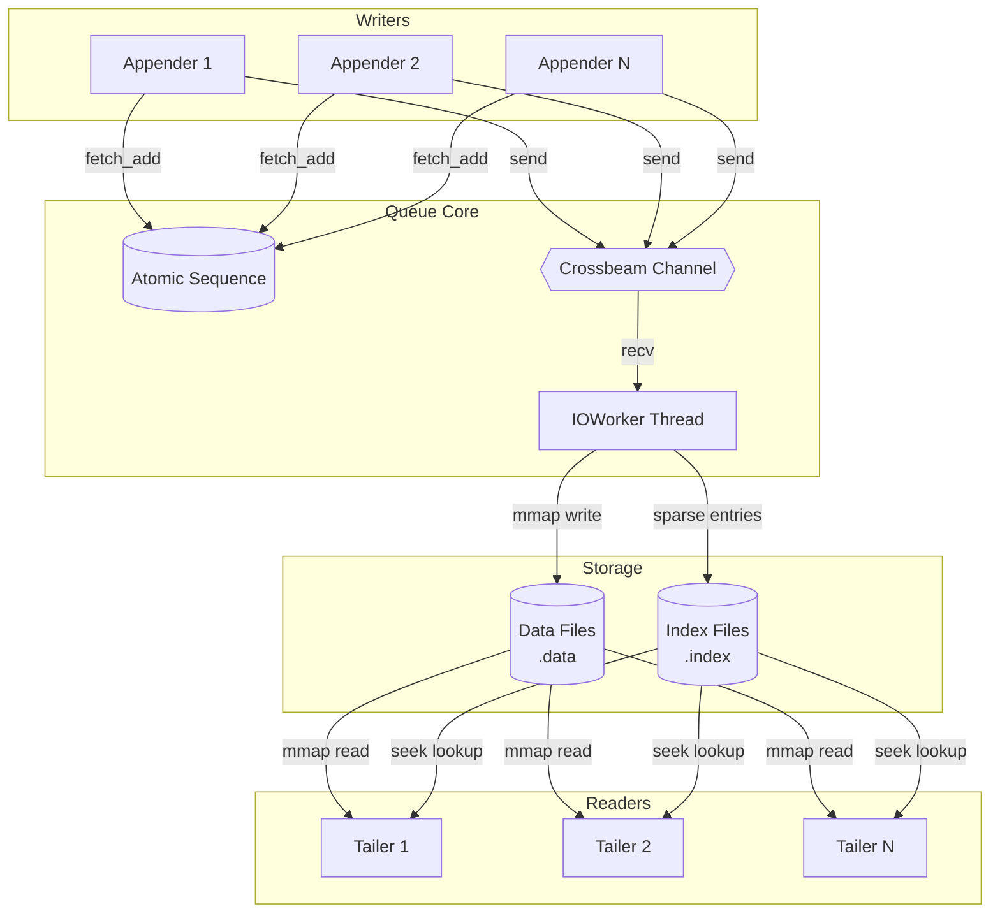
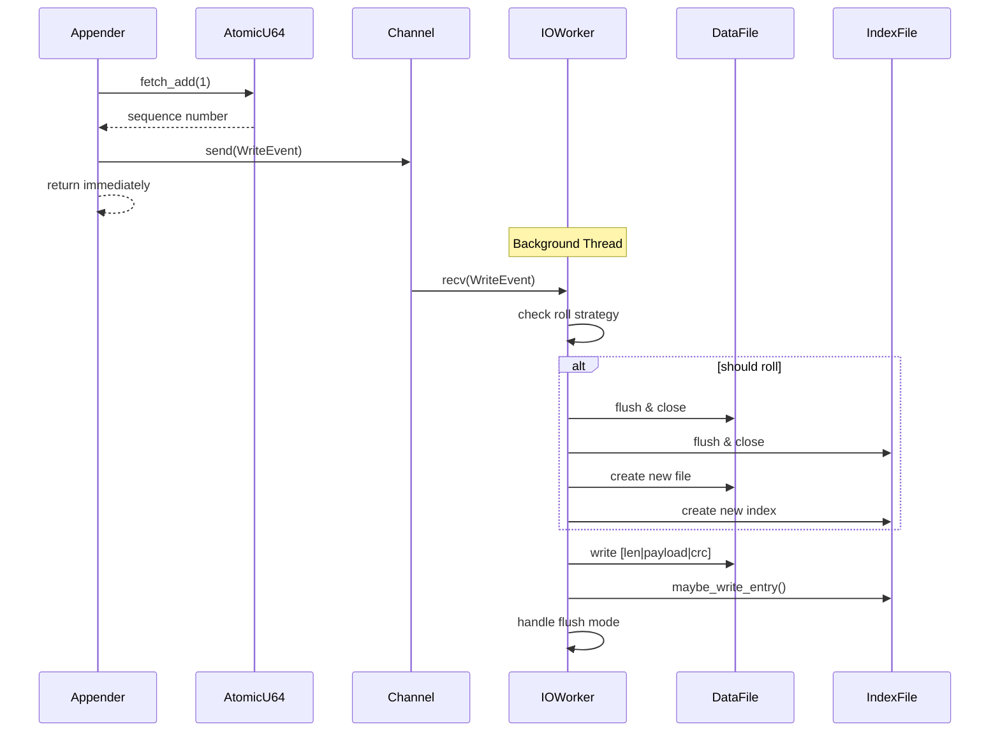
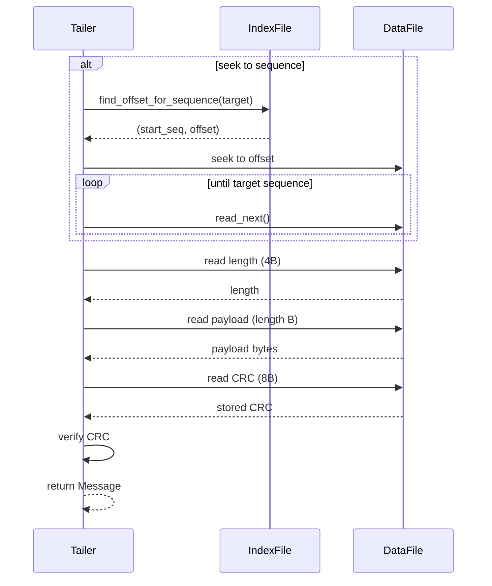
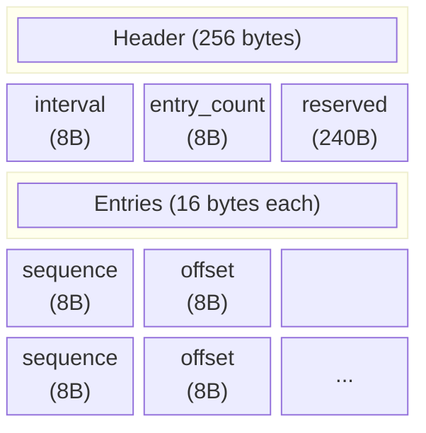
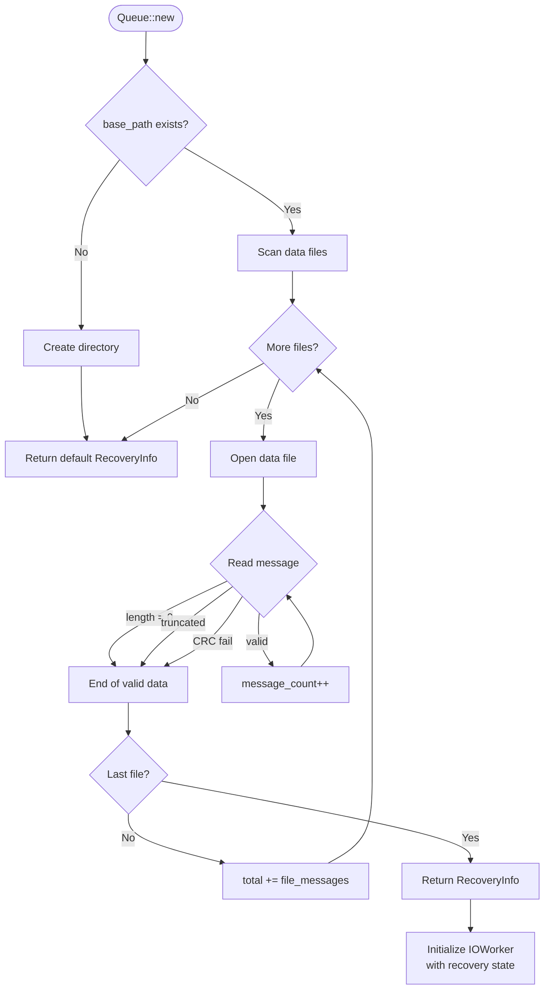

# Persistent Queue

A high-performance, persistent append-only queue inspired by [Chronicle Queue](https://github.com/OpenHFT/Chronicle-Queue). Designed for low-latency, high-throughput message storage with crash recovery.

## Quick Start

```rust
use queue::{QueueBuilder, FlushMode, RollStrategy};
use std::time::Duration;

// Create a queue
let queue = QueueBuilder::new("/path/to/queue")
    .file_size(1024 * 1024 * 1024)  // 1GB files
    .roll_strategy(RollStrategy::BySize(1024 * 1024 * 1024))
    .flush_mode(FlushMode::Batch { 
        bytes: 64 * 1024, 
        interval: Duration::from_millis(100) 
    })
    .build()?;

// Write messages
let appender = queue.create_appender();
let seq = appender.append(b"hello world")?;

// Read messages
let mut tailer = queue.create_tailer()?;
while let Some(msg) = tailer.read_next()? {
    println!("seq={} payload={:?}", msg.sequence, msg.payload);
}

// Clean shutdown
queue.shutdown()?;
```

## Architecture

### Overview



### Write Path



1. **Appender** atomically assigns a sequence number and sends the message to a channel
2. **IOWorker** (background thread) receives messages and writes to mmap'd data files
3. **Sparse index** entries are written every N messages for fast seeking

This design decouples write latency from disk I/O - `append()` returns as soon as the message is enqueued.

### Read Path



1. **Tailer** reads directly from mmap'd files (zero-copy)
2. **Seek** uses sparse index for O(log n) lookup, then linear scan
3. **CRC64** verification on every message read

## On-Disk Format

### Message Format

Messages are stored contiguously in data files:


```
┌─────────────────┬──────────────────────┬─────────────────┐
│  Length (4B)    │   Payload (variable) │   CRC64 (8B)    │
│  little-endian  │   raw bytes          │   little-endian │
└─────────────────┴──────────────────────┴─────────────────┘
```

- **Length**: 4-byte little-endian u32 (payload size only)
- **Payload**: Variable-length raw bytes
- **CRC64**: 8-byte checksum over the payload

### Index Format

Sparse index for efficient seeking:



Only every Nth message is indexed (configurable via `index_interval`).

### Directory Structure

```
base_path/
├── 2026/
│   └── 01/
│       └── 15/
│           ├── 20260115-0001.data
│           ├── 20260115-0001.index
│           ├── 20260115-0002.data
│           └── 20260115-0002.index
```

Files are organized by date for easy archival and cleanup.

## Configuration

### QueueBuilder

| Method | Description | Default |
|--------|-------------|---------|
| `file_size(u64)` | Maximum size per data file | 1 GB |
| `roll_strategy(RollStrategy)` | When to roll to new file | BySize(1GB) |
| `flush_mode(FlushMode)` | How writes are synced to disk | Async |
| `index_interval(u64)` | Messages between index entries | 1024 |
| `verify_on_startup(bool)` | CRC check during recovery | false |

### RollStrategy

| Variant | Description |
|---------|-------------|
| `BySize(bytes)` | Roll when file exceeds size |
| `ByTime(duration)` | Roll after duration elapsed |
| `ByCount(n)` | Roll after n messages |
| `Combined(vec)` | Roll when any strategy triggers |

### FlushMode

| Variant | Description | Durability | Performance |
|---------|-------------|------------|-------------|
| `Async` | OS decides when to flush | Lowest | Highest |
| `Sync` | Flush after every write | Highest | Lowest |
| `Batch { bytes, interval }` | Flush on threshold or timeout | Medium | Medium |

## Recovery

On startup, the queue scans existing data files to determine:
- Next sequence number to assign
- File and byte offset to resume writing



Recovery algorithm:
1. Scan all data files in chronological order
2. For each file, count valid messages (optionally verify CRC)
3. Stop at first zero-length, truncated, or corrupted message
4. Resume writing from that position

## Thread Safety

- **Queue**: Thread-safe for creating appenders and tailers
- **Appender**: Thread-safe, can be cloned and shared
- **Tailer**: NOT thread-safe, use one per thread

Multiple writers and readers can operate concurrently on the same queue.

## Design Decisions

### Why mmap?

Memory-mapped I/O provides:
- Zero-copy reads (payload is a slice into the mmap)
- Efficient sequential writes
- OS-managed page cache

### Why sparse index?

Full indexing would consume too much space. Sparse indexing (every Nth message) provides:
- O(log n) seek to approximate position
- Small index file size
- Acceptable linear scan for final positioning

### Why background IOWorker?

Decoupling appender from disk I/O:
- `append()` returns in microseconds
- Disk latency doesn't block callers
- Single writer simplifies file management
